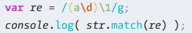

# JavaScript 正则表达式

> 例:


> 1.找到字符串中的数字, 存在数组中


> 2.找到字符串中的连续数字, 存在数组中


### 正则表达式
什么是正则表达式?
     规则表达式

查找匹配某些符合规则的字符串, 正则表达式就是写这种规则的工具。

利用事先定义好的一些特定字符、及这些特定字符的组合，组成某种规则。

#### 定义正则

> var str = 'miaovketang'; //查找字母v

1.字面量形式(推荐, 一般较方便)
var re = /正则字符串/[标识符]
> var re = /v/g; //创建查找字母v的正则表达式,并把它赋值给变量re

2.利用构造函数
var re = new RegExp(正则字符串 [, 标识符])
> var re = new RegExp(v, g);

当正则字符串在代码在页面运行前已知的情况下,使用字面量形式定义正则表达式比较简洁方便.

但如果 正则字符串 的获取方式是一个随时变化的变量, 或者 表达式及函数的返回值, 则只能用 构造函数.

#### 正则表达式的组成
正则表达式由一些普通字符和一些元字符组成。

普通字符包括大小写的字母和数字， 而元字符则有特殊含义。
> a  abc  123 普通字符

转义字符 转义符 \ 后面跟一个普通的字符, 代表一个或一段特殊的内容。

\d 代表一个数字
\n 换行
\0 空字符

```js
var str = '通知: \n今天天气好, 下午放假!';
alert(str);
```


**标识符**
g global全局搜索
+ 限定+号前一个字符重复出现一次到多次
#### 学习新API的方法
1. 哪一个对象下的方法
2. 这个方法是做什么的
3. 参数(参数的个数, 参数的类型)
4. 方法的返回值

### 正则表达式的几个方法

#### 1) test
**作用**: 查看字符串中是否有 正则字符串。

**语法**：
RegexObj.test(String) => Boolean
正则表达式.test(字符串) 返回 布尔值

**参数**: String 查找的字符串。

**返回值**: 布尔值 true 或 false
字符串中有 正则字符串就返回true, 否则就为false

```js
var str = 'absdr1de2ge3';
var re = /\d/;
console.log( re.test(str) )  //true
```

##### lastIndex
```js
var str = 'miao12vketang';
var re = /\d/g;

console.dir(re);//打印正则表达式的目录
```

正则对象有个lastIndex属性。当正则有全局搜索标识符g,在使用test时, 每调用一次test, 都会记录(匹配到的字符的位置 + 匹配到的字符串长度),记录在lastIndex属性中。


#### 2) search
**作用**: 检索指定字符串或正则表达式匹配的字符串。

**语法**：
String.search(String | RegexObj) => Number
字符串.search(字符串 或 正则表达式) 返回 数字

**参数**:
String | RegexObj
字符串 或 正则表达式。

**返回值**: 返回数字——返回字符串中**首次**出现 正则字符串 的位置。没有检索到返回-1。

search和indexOf在传入字符串的时候功能是一样的。search可以接受 正则表达式 为参数, indexOf不可以。

```js
var str = 'miao3vke12tang';

console.log(str.indexOf('1')); //8
console.log(str.search('1'));  //8

var re = /3/

console.log(str.indexOf(re)); //-1
console.log(str.search(re));  //4
```

**标识符 i**

```js
var str = 'miAovketang';
var re = /a/gi

str.search(re); //2
```

#### 3) match
**作用**: 检索字符串中 与指定字符串或正则表达式相匹配的字符串。

**语法**：
String.match(Sting | RegexObj) => Array
字符串.search(字符串 或 正则表达式) 返回 数字

**参数**: Sting | RegexObj 字符串 或 正则表达式。

**返回值**: 调用match的字符串中, 符合正则表达式的字符串 组成的数组。

注意:参数为RegexObj时, 如果不带g标识符, 则只会匹配一个字符串, 并且数组会有该字符串在原字符串中的序号位置index和input属性(原字符串本身);

```js
var str = 'miaov22ketang',
    re = /d+/;

console.log( str.match(re) );
```

并且这二个属性是可以访问和取出来的.

```js
var i = str.match(re).index,
    str2 = str.match(re).input;

console.log(i, str2);
```


如果带g标识符,则为全局匹配, 返回的是匹配到的字符串组成的数组;即使数组只有一个元素,也不会带有index和input属性.

```js
var str = 'miaov22ketang',
    re = /d+/g;

console.log( str.match(re) );
```

#### 4) replace
**作用**: 替换掉字符串中 与指定字符串或正则表达式相匹配的字符串。

**语法**：
String.replace(Sting | RegexObj, Sting | function(){}) => String
字符串.replace(字符串 或 正则表达式, 替换成的字符串 或 函数返回值) 返回 字符串。

**参数**: Sting | RegexObj, Sting | function(){}
第一个参数: 字符串或正则表达式
第二个参数: 字符串或函数

注意:第二个参数为函数时, 函数必须有返回值, 否则替换后的内容为undefined。

**返回值**: 替换后的新字符串。

```js
var str = 'abc123';

var newStr = str.replace('b', '*');
var newStr2 = str.replace(/\d/g, '*');

console.log(str); // abc123 (原字符串不变)
console.log(newStr); // a*c123
console.log(newStr2);// abc***
```

**详解replace的回调函数**
> 例:隐藏电话号码的中间4位

```js
var str = '17717070917';

replace的回调函数,每匹配到一次都会调用一下函数
var newStr = str.replace(/\d/g, function(r0, r1, r2){
    /*
        r0 检索到的字符串
        r1 检索到的字符串的位置
        r2 被检索的字符串
    */
    console.log(r0, r1, r2);

    return ( r1 > 2 && r1 < 7 ) ? '*' : r0;
});
console.log('');
console.log(newStr);
```


> var re = /(12)+(ab)(?:a1)(45)+/;
> str.replace(re, function(r0, r1, r2, r3){ } )

正则表达式中的()称为一个子项,当replace匹配的正则表达式有多个子项时, 回调函数中的
* 第一个参数r0 为正则 完整匹配到的字符串
* 从第二个参数起, 就是子项匹配到的内容
* 写完参数的话, 倒数第二个参数是完整匹配到的字符串index下标;倒数第一个是要替换的字符串。
* ?:不捕获分组信息 , (?:a1)表示只是想把a1作为整体,回调函数的参数查不到这个分组的信息


**\d 一个数字 \D 一个非数字**
> 例:将下列数据统一格式化为: 2016年03月10日 格式。

```js
var s1 = "2016-03-28",
    s2 = "2016++++03++++28",
    s3 = "2016/////03/////28",
    s4 = "2016+===03-====28";

var re = /(\d+)\D+(\d+)\D+(\d+)/g; //提取数字

var str = s1.replace(re, function(r0, r1, r2, r3, r4, r5){
        console.log(r0); // 2016-03-28 检索到的字符串
        console.log(r1); // 2016 子项匹配到的内容
        console.log(r2); // 03 子项匹配到的内容
        console.log(r3); // 28 子项匹配到的内容

        console.log(r4); //0 检索到的字符串的位置
        console.log(r5); //2016-03-28 被检索的字符串

        return (r1 + '年' + r2 + '月' + r3 + '日');
    })
console.log(str); //2016年03月28日
```

**[ ]** 放入字符集, 匹配括号中任意**一个**字符(注意只一个).

[0-9] 查找0,1,2,3,4,5,6,7,8,9

[a-z] 查找a到z

[A-Z] 查找A到Z

需要里面的字符的Unicode编码连续, 如果不连续写法是
[0-46-9] 不包含5,查找0,1,2,3,4,5,7,8,9

[\u4e00-\u9fa5] 汉字的Unicode编码范围区间

**decodeURI() 转义Unicode编码**

decodeURI('\u4e00') // 一

decodeURI('\u9fa5') // 龥

**^** 写在[^ ]里,代表排除[ ]中的字符
var re = /a[\^13579]c/; 规则:a开头c结尾, 中间不是1,3,5,7,9

#### 限制符

也是元字符的一种, 作用就是限制前一个字符重复出现的次数,有六种

**+** 重复出现最少一次, 最多不限

**\*** 重复出现最少0次, 最多不限

**?** 重复出现最少0次, 最多一次

**{n}** 重复出现n次

**{n,}** 重复出现最少n次, 最多不限

**{n,m}** 重复出现最少n次, 最多m次

#### 字符串的开始^ $字符串的结尾$

> 验证QQ, 分析QQ的规则:纯数字 5-12位, 不能以0开头

```js
//排除了0, 但排除不掉非数字字符,所以正确编写如下
var re = /^[^0]\d{5-12}$/

var re = /^ [1-9]\d{4,11}$/; //以1-9开头,开头占了一位,后面就是4到11位
```

#### 转义字符

**\d** 一个数字

**\D** 一个非数字

**\s** 一个空格

**\S** 一个非空格

> 编写字符串trim()函数(去掉首尾字符串)
```
var str = '   mi  ao   ';
function trim(str){
    //匹配空格开头或空格结尾的字符串, 将前后空格替换为空字符串
    return str.replace(/^\s+ | \s+$/g, '');
}
console.log(trim(str));
```

**\w** 数字,字母,下划线
**\W** 非(数字,字母,下划线)
**\b** 单词的边界符(单词:连续的\w。即\w的左或右不是一个\w就存在一个边界符)
**\B** 非边界符


**.** 点,代表任意字符(除了\n)
**\1\2\3** 反向引用,引用整个正则中,分组里的内容,\1 引用第一组的内容, \2 引用第二组的内容......以此类推.

> 例一


> 规则 以a开头后面跟一个数字,重复这个组合一次到多次.


> str在匹配re时, 先匹配到a1, 然后\1引用前面这个a1,所以该正则表达式在字符串里查找的是 a1a1


---

> str在匹配re2时, 先匹配到a1, 然后\1引用a1(+号连续1个到多个); \2引用的是数字1(+号连续1个到多个)。


> str = 'a1a1a1112a1a1', 在2这里截取了前部分;后面a1a1由于后面少了\2引用的至少一个'1',所以后半段没匹配到.

---
> 例二 找出字符串中重复项最多的字符和其个数


---
**贪婪模式**: 尽可能匹配多的字符.
**懒惰模式**: 尽可能少的匹配字符.
**?** 开启懒惰模式

> 例:从网页上扒小说


> 要消除的是 < 两个尖括号之间的文字 >


> 因str的< p >和< /p >最前面<和最后的>2个尖括号匹配了re,所以中间的需要的文字也被匹配替换成'',打印结果就是空了.


> 添加?号开启懒惰模式


