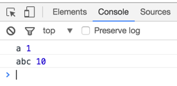

# JavaScript 包装对象
对象身上都可挂载属性

当使用**原始类型**的值(**sting**、**number**、**boolean**), 在调用对应属性和方法时候, 内部会自动转成对应的对象. 隐式创建这个对象, 就成为包装对象.

包装对象的特点
隐式创建对象后, 可以调用对应的属性和方法, 使用后, 立马销毁, 所以不能给原始类型的值添加属性和方法.
```js
var str = "miaov";
//假设是对象, 挂载属性
str.a = 1; //把str包装成一个对象, 用完之后立马销毁

console.log(str.a);//获取不到
```

#### hasOwnProperty
**作用**: 用来判断某个对象是否含有指定的自身属性.

**语法**: object.hasOwnProperty ( prop ) => boolean.

**参数**: prop 要检查的属性名称.

**返回值**: 返回boolean值, true:是自身属性; false: 不是自身属性.

**注意**: 不会沿着原型链查找属性, 只查找自身属性.

#### for in 遍历对象(数组也属于对象)
用来遍历对象, 每个不同的属性, 语句都会被执行一次.

**注意:** 默认情况, 一个对象下的非用户定义的属性/方法, 不能通过for in遍历; 用户添加的属性/方法是可以被遍历的, 即使是添加到原型链上的.
```js
//给Object基础数据类型的原型添加属性
Object.prototype.abc = 10;

//创建对象
var obj = { a:1 };

for( var key in obj ){
	console.log( key, obj[key] );
}
```


**检查对象身上是否某属性**:
```js
for( var key in obj){
	if( obj.hasOwnProperty(key)){
		console.log(key);
	}
}
```

### 改变函数this指向的三个函数

#### call( )
**作用**: 改变函数this的指向,并执行函数.

**语法**: methodName.call(thisTarget, arg1, arg2, arg3...) => undefined.

**参数**: thisTarget 函数中this指向的目标. arg1, arg2, arg3...为原函数的参数.

**返回值**: undefined.

**注意**:thisTarget为null或undefined(没填),函数的this指向window.

#### apply( )
**作用**: 改变函数this的指向,并执行函数.

**语法**: methodName.apply(thisTarget, [arg1, arg2, arg3...])

**参数**: thisTarget 函数中this指向的目标. arg1, arg2, arg3...为原函数的参数,不过需要写在数组里.

**注意**:thisTarget为null或undefined(没填),函数的this指向window.

#### bind( )
**作用**:bind( )会改变函数中的this指向, 但不会立刻执行函数.
**语法**: methodName.bind(thisTarget, arg1, arg2, arg3...)
**机制**: bind( )方法会创建一个新函数.当这个新函数被调用时, bind( )的第一个参数将作为它运行时的this,之后的参数是原函数的参数.

> 手动实现Function原型的bind方法
```js
Function.prototype.bind = function (thisTarget) {
	//this -> 调用bind的函数
	var _this = this;
	return function () {
		//改变调用bind的函数的this指向
		_this.call(thisTarget);
	}
}

function fn() {
	console.log(this);
}

fn();//打印window, this指向window

//把fn函数的this指向一个数组
//因bind不会立即执行函数,所以通过点击事件触发
document.onclick = fn.bind([1,2,3]);//点击打印[1,2,3]
```


### 函数中this的指向
this在函数中, this的值是在调用时确定的
函数的调用方式:
1. 直接调用 this -> window
```js
fn(); //this -> window
```
2. 匿名函数自执行 this -> window
```js
(function (){
	console.log(this);
	}) //this -> window
```
3. 事件调用 this -> 触发事件的元素
```js
document.onclick = fn; //this -> document
```
4. 定时器调用 this -> window
```js
setInterval(fn,1000); //this -> window
```
5. new调用 this -> 函数内部隐式创建的实例
```js
var arr = new Array(1,2,3); //this -> arr 隐式创建的对象被变量arr储存了.
```
6. call／apply／bind this -> 传入的第一个实参
```js
fn.call([1,2,3],45,78); //this -> [1,2,3]

fn.apply('lily',[1,2,3,4]); //this -> 'lily'

fn.bind(456, 9, 10);//this -> 456
```
7. 作为对象属性值被调用 this -> 调用函数的对象
```js
var obj = {fn:function(){console.log(this)}};

obj.fn(); // this -> obj

document.onclick = obj.fn; // this -> document
```
