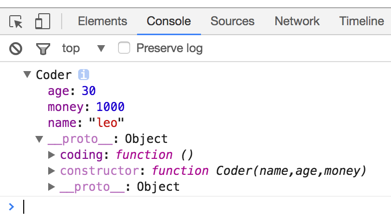
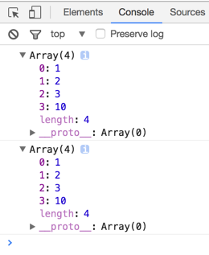

# JavaScript 继承

构造函数中某些值在创建实例时才能确定, 把属性写在构造函数中, 初始化某一个属性的值.

> 子类拥有父类的属性和方法.

```js
//创建构造函数
function Person(name, age){
	this.name = name;
	this.age = age;
}
//给构造函数添加方法
Person.prototype.say = function () {
	console.log("Hello, My name is" +this.name+"I am"+this.age+"years old");
}
Person.prototype.run = function () {
	console.log("My running speed is 10m/s");
}
//具体实例
var xiaoMing = new Person('xiaoMing', 26);
```
### 继承

- call方法继承父级构造函数中的属性

```js
function Coder(name, age, money) {
	//this -> Coder创建的实例
	//用call改变Person的指针,使Person中的this指向Coder创建的实例
	Person.call(this, name, age);
	//创建属于Coder自身的属性
	this.money = money;
}

Coder.prototype.coding = function () {
	console.log("我会编程");
}

var xiaoWang = new Coder("xiaoWang", 28, 30000);

console.log(xiaoWang);

```



- #### 深度复制继承父级构造函数原型中的方法
由于js里对象是引用数据类型

```js
var arr = [1,2,3];

var arr2 = arr;

arr2.push(10);

console.log(arr);
console.log(arr2);
```


所以我们需要一种方法:
> 复制一个对象, 使复制出来的对象和被复制的对象数据一模一样,但不再关联,不共享内存地址.

```js
function clone(ele) {
	var result;
	if(typeof ele === 'object'){
		if(Array.isArray(ele)){
			result = [];
		}else {
			result = {};
		}
	}else {
		result = ele;
	}
}
```

子级构造函数继承父级构造函数原型的方法就是

```js
Coder.prototype = clone(Person.prototype);
```

**总结**

*让子类拥有父类的属性、方法的方法是*

1.拥有构造函数中的属性
	父类.call(子类的实例, 参数1, 参数2)

2.拥有原型上的属性
	把父类的原型对象复制一份 for in


#### instanceof 二元运算符

实例 instanceof 函数

二元运算符
运算检测一个实例的原型是否在目标构造函数的原型链上.

语法: object **instanceof** instance
返回true: 在目标实例的原型链上.
返回false: 不在目标实例的原型链上.
