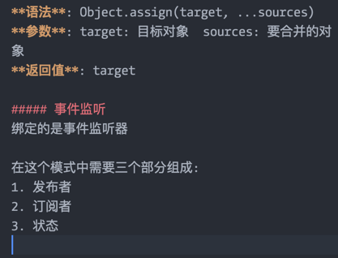

# JavaScript 面向对象class

### 面向对象思想
**类**:描述一组具有相同特性(属性)和功能(方法)的对象.
**实例**:类的具体体现.
**语法糖**:简化一些操作.

### class
es6使用关键字class声明类, 声明类 不会提升在当前作用于的最顶端.
```js
class className{
	//当使用new来创建对象, 会自动调用constructor函数
	constructor(/*这里写属性的参数*/){/*这里写属性*/}
	/*外面写方法*/
}
```
**new** className
1. 隐式创建一个对象
2. 令函数中this指向这个对象
3. 执行函数, 通过this给对象挂载属性
4. 自动返回对象
> 例 声明Person类
```js
class Person{
	constructor(name,age){
		this.name = name;
		this.age = age;
	}
	/*在这里写的方法,都会挂载在原型上*/
	say(){
		console.log('我的名字是:'+this.name, '我今年'+this.age+'岁');
	}
	run(){
		console.log('我会奔跑');
	}
}

var lily = new Person('lily', 22);
```
#### 子类继承
- 如果子类不需要添加新的属性,可以省略constructor函数不写,照样会继承父级的属性;
- 如果子类要添加新的属性, 就要写constructor函数, 并带上父类的相同的参数;并且constructor函数里还要写上super(父级的参数), super其实就是调用父类的constructor函数;
```js
class Coder extends Person{
	constructor(name,age, money){
		super(name,age);
		this.money = money;
	}
	coding(){
		console.log('我会编程');
	}
}
```

##### 静态属性/方法 static
构造函数上 标明 static的属性 称为静态属性; 标明 static的方法 称为静态方法; 不会被子类继承.
```js
class Person{
	constructor(stature){
		static this.stature = stature;
	}
	static joke() {
		console.log("Are you kidding me ?");
	}
}
```

##### Object.assign
**作用**: 用于将所有可枚举的属性值, 从一个或多个源对象复制到目标对象(浅复制)。
**语法**: Object.assign(target, ...sources)
**参数**: target: 目标对象  sources: 要合并的对象
**返回值**: target

##### 事件监听
绑定的是事件监听器

在这个模式中需要三个部分组成:
1. 发布者
2. 订阅者
3. 状态

